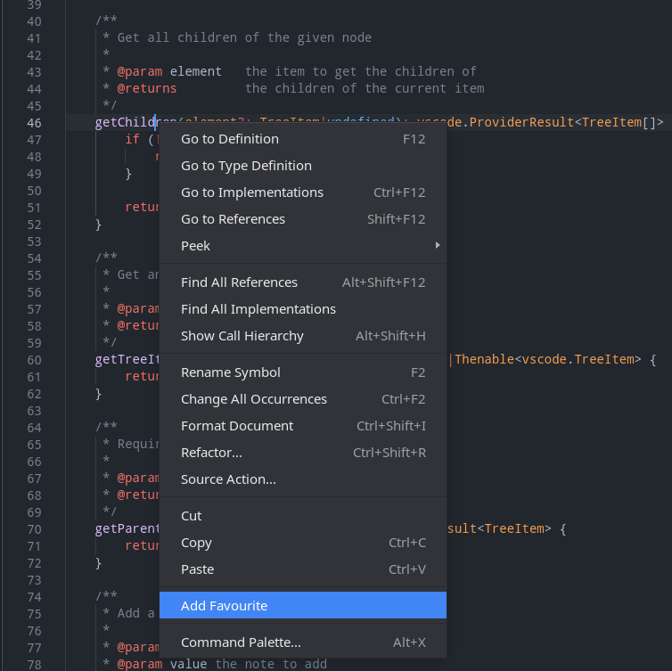
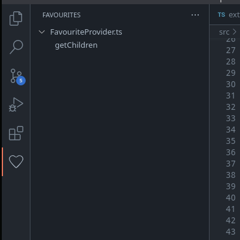

# SpecialSymbols VSCode Extension

Allows program symbols to be **favourited** for easy access. Symbols can also have **notes** attached to them.

## Usage

Initially, the favourites sidebar will be empty as no symbols have been favourited.

To add a new favourite symbol, open a new code file and right-click the symbol you would like to favourite. Click the 'Add favourite' button.

The symbol will then appear in the SpecialSymbols sidebar.

Go to a symbol by clicking the symbol. It is as easy as that!

Notes can be added to each symbols by clicking the 'Add note' button on the symbol in the sidebar.

Symbols can be deleted from the sidebar by right-clicking the symbol and clicking the 'Delete' button.
